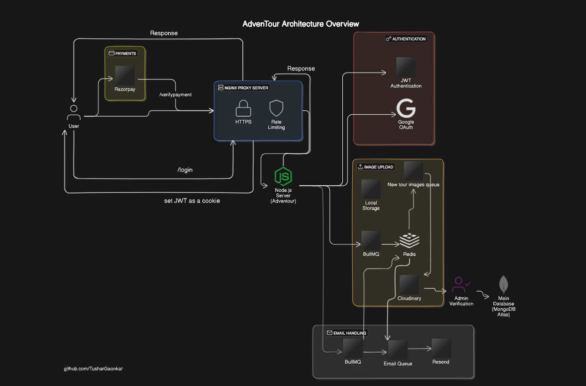

<a name="readme-top"></a>

<!-- PROJECT LOGO -->
<br />
<div align="center">
  <a href="https://adventour-explore.vercel.app">
    
  </a>

  <p align="center">
   <h4  style="font-size: 27px; font-weight: bold">ADVENTOUR</h4>
   <i>Your journey, our expertise!</i>
  </p>
    <a href="https://adventour-explore.vercel.app">View Demo</a>
    ·
    <a href="https://github.com/TusharGaonkar/AdvenTour-Backend/issues/new">Request Feature</a>
  </p>
  
</div>

<!-- ABOUT THE PROJECT -->

## About

AdvenTour is a platform that connects adventure seekers with local tour guides. It allows users to explore and book adventure tours in their nearby areas based on their preferences. Tour guides can easily list and promote their offerings on the platform, providing detailed information about the adventures they lead. With AdvenTour, adventure enthusiasts can discover and experience new unexplored places in their vicinity, guided by knowledgeable locals who know the area best.

<p align="right">(<a href="#readme-top">back to top</a>)</p>

### Built With

`Tech stack of AdvenTour Backend`

[](https://www.typescriptlang.org/)
[](https://nodejs.org/en/)
[](https://expressjs.com/)
[](https://www.mongodb.com/)
[](https://mongoosejs.com/)
[](https://www.nginx.com/)
[](https://bullmq.io/)
[](https://redis.io/)
[](https://cloudinary.com/)
[](https://www.passportjs.org/)
[](https://jwt.io/)
[](https://developers.google.com/identity/sign-in/web/)
[](https://razorpay.com/)
[](https://www.docker.com/)
[](https://react-email.com/)
[](https://resend.com/)
[](https://github.com/helmetjs/helmet)

<p align="right">(<a href="#readme-top">back to top</a>)</p>

<!-- Features -->

## AdvenTour Architecture Overview



## AdvenTour MongoDB schema design choices

Model name: AdvenTour (v-1.0)

Author: Tushar Gaonkar (gaonkar.tushar01@gmail.com)

Created with: [Hackolade](https://hackolade.com/) - Polyglot data modeling for NoSQL databases, storage formats, REST APIs, and JSON in RDBMS

### <a id="contents"></a>

- [Table of Contents](#contents)
- [1\. Model](#model)
- [2\. Relationships](#relationships)
  - [2.1 fk tours.\_id to bookings.tour](#4845313c-1d19-459a-ac12-6d485131e5df)
  - [2.2 fk users.\_id to bookings.user](#e43d34ee-5b97-4f87-9b0d-404a3be61784)
  - [2.3 fk tours.\_id to bookmarkedtours.tour](#1b405dae-943f-4a38-afdf-341e1f94d50d)
  - [2.4 fk users.\_id to bookmarkedtours.user](#c393b3b6-17ce-4916-a7e1-1eda370d49b2)
  - [2.5 fk tours.\_id to tourreviews.tour](#6b5a2ad0-b10b-40c8-a2b0-9364eac8e072)
  - [2.6 fk users.\_id to tourreviews.user](#8ee9efb2-62eb-4cd3-af7a-42623a88def7)
  - [2.7 fk users.\_id to tours.createdBy](#eed26d02-19d4-4944-983d-f7048fc6fb42)
  - [2.8 fk users.\_id to toursvalidations.createdBy](#85fda57f-284e-4af0-9e1c-fac4123c1e39)

### <a id="model"></a>

##### 1\. Model **AdvenTour (v-1.0)**

##### 1.1.1 **AdvenTour (v-1.0)** Entity Relationship Diagram


##### 2\. Relationships

### <a id="4845313c-1d19-459a-ac12-6d485131e5df"></a>2.1 Relationship **fk tours.\_id to bookings.tour**

##### 2.1.1 **fk tours.\_id to bookings.tour** Diagram

<table><thead><tr><td>Parent Table</td><td>Parent field</td></tr></thead><tbody><tr><td>tours</td><td>_id</td></tr></tbody></table>


<table><thead><tr><td>Child Table</td><td>Child field</td></tr></thead><tbody><tr><td>bookings</td><td>tour</td></tr></tbody></table>

##### 2.1.2 **fk tours.\_id to bookings.tour** Properties

<table><thead><tr><td>Property</td><td>Value</td></tr></thead><tbody><tr><td>Name</td><td>fk tours._id to bookings.tour</td></tr><tr><td>Parent Collection</td><td>tours</td></tr><tr><td>Parent field</td><td>_id</td></tr><tr><td>Parent Cardinality</td><td>1</td></tr><tr><td>Child Collection</td><td>bookings</td></tr><tr><td>Child field</td><td>tour</td></tr><tr><td>Child Cardinality</td><td>0..n</td></tr></tbody></table>

### <a id="e43d34ee-5b97-4f87-9b0d-404a3be61784"></a>2.2 Relationship **fk users.\_id to bookings.user**

##### 2.2.1 **fk users.\_id to bookings.user** Diagram

<table><thead><tr><td>Parent Table</td><td>Parent field</td></tr></thead><tbody><tr><td>users</td><td>_id</td></tr></tbody></table>


<table><thead><tr><td>Child Table</td><td>Child field</td></tr></thead><tbody><tr><td>bookings</td><td>user</td></tr></tbody></table>

##### 2.2.2 **fk users.\_id to bookings.user** Properties

<table><thead><tr><td>Property</td><td>Value</td></tr></thead><tbody><tr><td>Name</td><td>fk users._id to bookings.user</td></tr><tr><td>Description</td><td></td></tr><tr><td>Parent Collection</td><td>users</td></tr><tr><td>Parent field</td><td>_id</td></tr><tr><td>Parent Cardinality</td><td>1</td></tr><tr><td>Child Collection</td><td>bookings</td></tr><tr><td>Child field</td><td>user</td></tr><tr><td>Child Cardinality</td><td>0..n</td></tr></tbody></table>

### <a id="1b405dae-943f-4a38-afdf-341e1f94d50d"></a>2.3 Relationship **fk tours.\_id to bookmarkedtours.tour**

##### 2.3.1 **fk tours.\_id to bookmarkedtours.tour** Diagram

<table><thead><tr><td>Parent Table</td><td>Parent field</td></tr></thead><tbody><tr><td>tours</td><td>_id</td></tr></tbody></table>


<table><thead><tr><td>Child Table</td><td>Child field</td></tr></thead><tbody><tr><td>bookmarkedtours</td><td>tour</td></tr></tbody></table>

##### 2.3.2 **fk tours.\_id to bookmarkedtours.tour** Properties

<table><thead><tr><td>Property</td><td>Value</td></tr></thead><tbody><tr><td>Name</td><td>fk tours._id to bookmarkedtours.tour</td></tr></td></tr><tr><td>Parent Collection</td><td>tours</a></td></tr><tr><td>Parent field</td><td>_id</td></tr><tr><td>Parent Cardinality</td><td>1</td></tr><tr><td>Child Collection</td><td>bookmarkedtours</a></td></tr><tr><td>Child field</td><td>tour</a></td></tr><tr><td>Child Cardinality</td><td>0..n</td></tr></tbody></table>

### <a id="c393b3b6-17ce-4916-a7e1-1eda370d49b2"></a>2.4 Relationship **fk users.\_id to bookmarkedtours.user**

##### 2.4.1 **fk users.\_id to bookmarkedtours.user** Diagram

<table><thead><tr><td>Parent Table</td><td>Parent field</td></tr></thead><tbody><tr><td>users</td><td>_id</a></td></tr></tbody></table>


<table><thead><tr><td>Child Table</td><td>Child field</td></tr></thead><tbody><tr><td>bookmarkedtours</a></td><td>user</a></td></tr></tbody></table>

##### 2.4.2 **fk users.\_id to bookmarkedtours.user** Properties

<table><thead><tr><td>Property</td><td>Value</td></tr></thead><tbody><tr><td>Name</td><td>fk users._id to bookmarkedtours.user</td></tr><tr><td>Parent Collection</td><td>users</a></td></tr><tr><td>Parent field</td><td>_id</a></td></tr><tr><td>Parent Cardinality</td><td>1</td></tr><tr><td>Child Collection</td><td>bookmarkedtours</a></td></tr><tr><td>Child field</td><td>user</a></td></tr><tr><td>Child Cardinality</td><td>0..n</td></tr></tbody></table>

### <a id="6b5a2ad0-b10b-40c8-a2b0-9364eac8e072"></a>3.5 Relationship **fk tours.\_id to tourreviews.tour**

##### 2.5.1 **fk tours.\_id to tourreviews.tour** Diagram

<table><thead><tr><td>Parent Table</td><td>Parent field</td></tr></thead><tbody><tr><td>tours</a></td><td>_id</a></td></tr></tbody></table>


<table><thead><tr><td>Child Table</td><td>Child field</td></tr></thead><tbody><tr><td>tourreviews</a></td><td>tour</a></td></tr></tbody></table>

##### 2.5.2 **fk tours.\_id to tourreviews.tour** Properties

<table><thead><tr><td>Property</td><td>Value</td></tr></thead><tbody><tr><td>Name</td><td>fk tours._id to tourreviews.tour</td></tr><tr><td>Parent Collection</td><td>tours</a></td></tr><tr><td>Parent field</td><td>_id</a></td></tr><tr><td>Parent Cardinality</td><td>1</td></tr><tr><td>Child Collection</td><td>tourreviews</a></td></tr><tr><td>Child field</td><td>tour</a></td></tr><tr><td>Child Cardinality</td><td>0..n</td></tr></tbody></table>

### <a id="8ee9efb2-62eb-4cd3-af7a-42623a88def7"></a>2.6 Relationship **fk users.\_id to tourreviews.user**

##### 2.6.1 **fk users.\_id to tourreviews.user** Diagram

<table><thead><tr><td>Parent Table</td><td>Parent field</td></tr></thead><tbody><tr><td>users</a></td><td>_id</a></td></tr></tbody></table>


<table><thead><tr><td>Child Table</td><td>Child field</td></tr></thead><tbody><tr><td>tourreviews</a></td><td>user</a></td></tr></tbody></table>

##### 2.6.2 **fk users.\_id to tourreviews.user** Properties

<table><thead><tr><td>Property</td><td>Value</td></tr></thead><tbody><tr><td>Name</td><td>fk users._id to tourreviews.user</td></tr><tr><td>Parent Collection</td><td>users</a></td></tr><tr><td>Parent field</td><td>_id</a></td></tr><tr><td>Parent Cardinality</td><td>1</td></tr><tr><td>Child Collection</td><td>tourreviews</a></td></tr><tr><td>Child field</td><td>user</a></td></tr><tr><td>Child Cardinality</td><td>0..n</td></tr></tbody></table>

### <a id="eed26d02-19d4-4944-983d-f7048fc6fb42"></a>2.7 Relationship **fk users.\_id to tours.createdBy**

##### 2.7.1 **fk users.\_id to tours.createdBy** Diagram

<table><thead><tr><td>Parent Table</td><td>Parent field</td></tr></thead><tbody><tr><td>users</a></td><td>_id</a></td></tr></tbody></table>


<table><thead><tr><td>Child Table</td><td>Child field</td></tr></thead><tbody><tr><td>tours</a></td><td>createdBy</a></td></tr></tbody></table>

##### 2.7.2 **fk users.\_id to tours.createdBy** Properties

<table><thead><tr><td>Property</td><td>Value</td></tr></thead><tbody><tr><td>Name</td><td>fk users._id to tours.createdBy</td></tr><tr><td>Parent Collection</td><td>users</a></td></tr><tr><td>Parent field</td><td>_id</a></td></tr><tr><td>Parent Cardinality</td><td>1</td></tr><tr><td>Child Collection</td><td>tours</a></td></tr><tr><td>Child field</td><td>createdBy</a></td></tr><tr><td>Child Cardinality</td><td>0..n</td></tr></tbody></table>

### <a id="85fda57f-284e-4af0-9e1c-fac4123c1e39"></a>2.8 Relationship **fk users.\_id to toursvalidations.createdBy**

##### 2.8.1 **fk users.\_id to toursvalidations.createdBy** Diagram

<table><thead><tr><td>Parent Table</td><td>Parent field</td></tr></thead><tbody><tr><td>users</a></td><td>_id</a></td></tr></tbody></table>


<table><thead><tr><td>Child Table</td><td>Child field</td></tr></thead><tbody><tr><td>toursvalidations</a></td><td>createdBy</a></td></tr></tbody></table>

##### 2.8.2 **fk users.\_id to toursvalidations.createdBy** Properties

<table><thead><tr><td>Property</td><td>Value</td></tr></thead><tbody><tr><td>Name</td><td>fk users._id to toursvalidations.createdBy</td></tr><tr><td>Parent Collection</td><td>users</a></td></tr><tr><td>Parent field</td><td>_id</a></td></tr><tr><td>Parent Cardinality</td><td>1</td></tr><tr><td>Child Collection</td><td>toursvalidations</a></td></tr><tr><td>Child field</td><td>createdBy</a></td></tr><tr><td>Child Cardinality</td><td>0..n</td></tr></tbody></table>

### <a id="edges"></a>

API Docs will be updated soon.

## Setting up the project for development

1. Clone the repository

```bash
git clone https://github.com/TusharGaonkar/AdvenTour-Backend.git
```

2. Navigate to the project directory

```bash
cd AdvenTour-Backend
```

3. Create a `.config.env` file with the following content.
   `Note that Nginx is disabled in development`, make sure to replace the placeholder values with your actual values.

```bash
FRONTEND_BASE_URL = 'http://localhost:5173'
BACKEND_BASE_URL = "http://localhost:2000"

BACKEND_DOMAIN = ""

PORT = 2000

NODE_ENV = 'developmment'

ORIGIN = "http://localhost:5173,http://localhost:4173,https://accounts.google.com"

DB_URI = 'YOUR_MONGODB_ATLAS_URI'
DB_PASSWORD = 'YOUR_MONGODB_ATLAS_PASSWORD'

JWT_SECRET = ''
JWT_TOKEN_KEY = "adventourUserJwt"
JWT_TOKEN_EXPIRATION = '25 days'

GOOGLE_AUTH_CLIENT_ID = ''
GOOGLE_AUTH_CLIENT_SECRET = ''
GOOGLE_AUTH_CALLBACK_URL= 'http://localhost:2000/auth/google/callback'

CLOUDINARY_CLOUD_NAME = ''
CLOUDINARY_API_KEY = ''
CLOUDINARY_API_SECRET = ''

RAZORPAY_KEY_ID = ''
RAZORPAY_KEY_SECRET = ''

ADMIN_LOGIN_URL = 'http://localhost:5173/admin/login'
USER_LOGIN_URL = 'http://localhost:5173/login'

RESEND_API_KEY = ''
ADMIN_EMAIL = ''

```

4. Start the `Docker` containers from the `docker.compose.yaml` file in detached mode.

```bash
docker-compose up -d
```

5. Navigate to the `http://localhost:2000/api/v-1.0/tours` URL in your browser you should see an empty response, try setting up the [AdvenTour-Frontend](https://github.com/TusharGaonkar/AdvenTour-Frontend)
   and try adding a tour make sure to replace the following in the `.env` file in the front end project.

   ```bash
   VITE_ADVENTOUR_BACKEND_URL = "https://adventour.live/api/v-1.0"
   # TO
   VITE_ADVENTOUR_BACKEND_URL = "http://localhost:2000/api/v-1.0"

   ```

6. To stop the running `Docker` containers from the `docker.compose.yaml` file.

```bash
docker-compose down
```

7. To remove all `Docker instances` from the `docker.compose.yaml` file.

```bash
docker-compose down

docker system prune

# check if there are any dangling container volumes and networks left
docker container prune

docker volume prune

docker network prune
```

⚠️ Please note that

In development mode, your local project directory is mapped to the `/app` directory in the container, any changes made in the project directory will be reflected in the container, no need to rebuild the container on changes.

## API Docs

API docs with endpoints will be updated soon.

## Contact

Tushar Gaonkar - gaonkar.tushar01@gmail.com
